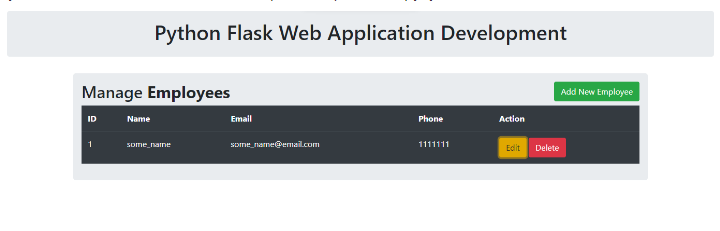

### Описание:

Имеется шаблон страницы для менеджмента сотрудников компании. На странице отображается список сотрудников,
есть кнопки для добавления (Add New Employee), редактирования (Edit) и удаления (Delete) записей.
Используя эти шаблоны можно создать простейшее Flask-приложение, отрендерить главную страницу и получить
в интерактивном виде то, что показано на скриншоте:

### Задача:

Реализовать бэкенд на фреймворке Flask, который выполняет следующее:
1. Отображение всех сотрудников на главной странице
2. Добавление сотрудников по кнопке Add New Employee с добавлением записей в БД
3. Редактировение информации о сотруднике по кнопке Edit с изменением записи в БД
4. Удаление сотрудника по кнопке Delete с удалением информации в БД

### Файлы:
1. Файл приложения - [app.py](app.py)
2. Модель БД - [models.py](models.py)
3. Обработчики - [routes.py](routes.py)
4. Шаблон основной страницы - [index.html](templates\index.html)